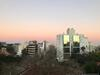
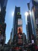

### [photos]
I don't consider myself even an amateur photographer, but I like to make some 
shots anyway, usually urban and nature landscapes from places I've visited. 
None of the photos received any treatment.

Please **don't use** these photos without permission, they are no big deal but 
have value to me. You can reach me [here](/about).

Hover the image to see the description and click to open the full image in a new 
page.

{:target="_blank" title="Miles Davis graffiti at Purple Reis Blues Pub - Curitiba"}
{:target="_blank" title="Sunny Sunday at Largo da Ordem fair - Curitiba"}
{:target="_blank" title="Colored sunset at Curitiba"}
{:target="_blank" title="Samurai graffiti at Liberdade - São Paulo"}

{:target="_blank" title="Some guys skateboarding at Av Paulista - São Paulo"}
{:target="_blank" title="Foggy morning at Curitiba"}
{:target="_blank" title="Two suns at Times Square - New York"}
{:target="_blank" title="Central Park noir - New York"}